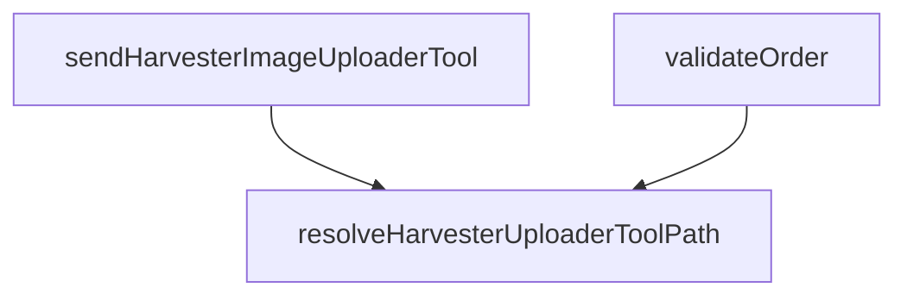

# 函数调用链可视化器

## 整体架构设计

### 1. 数据层
- **输入格式**：实际的JSON文件结构（包含`summary`、`nodes`、`edges`）
- **节点类型**：`Function`、`API`等
- **边类型**：`CALLS`（调用关系）

### 2. 处理层
- **数据解析**：读取并解析JSON文件
- **数据验证**：验证JSON结构的完整性
- **数据转换**：将原始数据转换为可视化所需的格式

### 3. 输出层
- **MDD格式**：生成Markdown兼容的格式，包含：
  - 统计概览
  - 节点列表（按类型分组）
  - 调用关系图（Mermaid）
  - 详细调用信息

- **HTML格式**：生成交互式知识图谱页面，包含：
  - 力导向图可视化
  - 节点搜索和筛选
  - 节点详情面板
  - 缩放和拖拽功能

### 4. 配置层
- **显示类型**：支持不同的名称显示方式
- **筛选选项**：支持按节点类型、文件路径等筛选
- **输出选项**：支持不同的输出格式和详细程度

## 功能概述

本skill用于从JSON文件中读取函数调用链数据，并将其以可视化的方式展示出来。支持两种输出格式：
1. **MDD格式**：生成Markdown兼容的格式，可直接在Markdown查看器中渲染
2. **HTML格式**：生成交互式知识图谱页面，可直接在浏览器中打开查看

支持三种名称显示类型：
1. **英文函数名**：仅显示英文函数名
2. **中文翻译名称**：仅显示中文翻译名称（无中文时回退到英文）
3. **中英文都显示**：同时显示英文和中文名称

## 输入参数

| 参数 | 类型 | 必填 | 描述 |
|------|------|------|------|
| `json_file_path` | string | 是 | 包含函数调用链数据的JSON文件的绝对路径 |
| `display_type` | string | 是 | 名称显示类型：'english'（英文函数名）、'chinese'（中文翻译名称）或'both'（中英文都显示） |
| `output_format` | string | 是 | 输出格式：'mdd'（Markdown格式）或'html'（知识图谱页面） |
| `output_file_path` | string | 否 | 输出文件的绝对路径（如果不指定，则输出到控制台） |
| `filter_node_types` | array | 否 | 要筛选的节点类型列表，如['Function', 'API']（如果不指定，则包含所有类型） |
| `max_nodes` | integer | 否 | 最大显示节点数（用于大型数据集，默认显示所有节点） |

## JSON数据结构要求

输入的JSON文件应包含以下结构：

```json
{
  "skill_version": "1.0",
  "analysis_type": "static",
  "summary": {
    "total_files": 200,
    "total_functions": 195,
    "api_endpoints": 653,
    "cloud_operations": 0,
    "tsx_components": 0
  },
  "nodes": [
    {
      "id": "function_0",
      "type": "Function",
      "name": "resolveHarvesterUploaderToolPath",
      "qualified_name": "/home/wangsen/programe/Coumpute.Tower-main/backend/src/index.ts#resolveHarvesterUploaderToolPath",
      "file_path": "/home/wangsen/programe/Coumpute.Tower-main/backend/src/index.ts",
      "location": {
        "start_line": 169,
        "end_line": 169
      },
      "signature": {
        "parameters": [],
        "return_type": ": { path: string; found: boolean }",
        "is_async": false,
        "is_exported": false
      },
      "props": [],
      "state_hooks": [],
      "children": [],
      "tags": []
    },
    {
      "id": "api_2",
      "type": "API",
      "name": "GET /api/tools/imageuploader.exe",
      "qualified_name": "/home/wangsen/programe/Coumpute.Tower-main/backend/src/index.ts#GET /api/tools/imageuploader.exe",
      "file_path": "/home/wangsen/programe/Coumpute.Tower-main/backend/src/index.ts",
      "location": {
        "start_line": 203,
        "end_line": 203
      },
      "signature": {
        "parameters": [],
        "return_type": "",
        "is_async": false,
        "is_exported": false
      },
      "props": [],
      "state_hooks": [],
      "children": [],
      "tags": [
        "api_endpoint",
        "get"
      ],
      "method": "GET",
      "path": "/api/tools/imageuploader.exe"
    }
  ],
  "edges": [
    {
      "id": "edge_0",
      "type": "CALLS",
      "from": "function_1",
      "to": "function_0",
      "call_type": "direct",
      "location": {
        "file": "/home/wangsen/programe/Coumpute.Tower-main/backend/src/index.ts",
        "line": 184
      },
      "context": "resolveHarvesterUploaderToolPath()"
    }
  ]
}
```

## 输出格式

### 1. MDD格式（Markdown显示）

生成Markdown兼容的格式，包含：
- **统计概览**：显示总文件数、总函数数、API端点等统计信息
- **节点列表**：按类型分组列出所有节点（函数、API等）
- **调用链图**：使用Mermaid语法的可视化流程图
- **详细调用信息**：显示调用关系、次数、位置和上下文

#### MDD输出示例

```markdown
# 函数调用链可视化

## 统计概览

| 指标 | 数值 |
|------|------|
| 总文件数 | 200 |
| 总函数数 | 195 |
| API端点 | 653 |
| 云操作 | 0 |
| TSX组件 | 0 |

## 节点列表

### Function类型节点（195个）

| ID | 名称 | 文件路径 | 起始行 |
|----|------|----------|--------|
| function_0 | resolveHarvesterUploaderToolPath | /home/wangsen/programe/Coumpute.Tower-main/backend/src/index.ts | 169 |
| function_1 | sendHarvesterImageUploaderTool | /home/wangsen/programe/Coumpute.Tower-main/backend/src/index.ts | 182 |
| ... | ... | ... | ... |

### API类型节点（653个）

| ID | 名称 | 方法 | 路径 | 文件路径 |
|----|------|------|------|----------|
| api_2 | GET /api/tools/imageuploader.exe | GET | /api/tools/imageuploader.exe | /home/wangsen/programe/Coumpute.Tower-main/backend/src/index.ts |
| api_3 | GET /api/tools/cloudmap-uploader.exe | GET | /api/tools/cloudmap-uploader.exe | /home/wangsen/programe/Coumpute.Tower-main/backend/src/index.ts |
| ... | ... | ... | ... | ... |

## 调用链图



## 调用详情

### sendHarvesterImageUploaderTool 调用：
- resolveHarvesterUploaderToolPath (1次，第184行)
  - 上下文：resolveHarvesterUploaderToolPath()

### validateOrder 调用：
- resolveHarvesterUploaderToolPath (1次，第18行)
  - 上下文：resolveHarvesterUploaderToolPath()
```

### 2. HTML格式（知识图谱页面）

生成交互式知识图谱页面，包含：
- **力导向图可视化**：使用D3.js实现的交互式力导向图
- **节点搜索**：支持按名称、ID、文件路径搜索节点
- **节点筛选**：支持按类型（Function、API等）筛选节点
- **节点详情**：点击节点显示详细信息（签名、参数、返回类型等）
- **缩放和拖拽**：支持鼠标缩放和节点拖拽
- **高亮显示**：鼠标悬停时高亮显示相关节点和边

#### HTML页面特性

1. **力导向布局**：节点自动排列，边表示调用关系
2. **颜色编码**：不同类型的节点使用不同颜色
   - Function：蓝色
   - API：绿色
   - 其他类型：橙色
3. **交互功能**：
   - 鼠标悬停：显示节点名称和相关边
   - 点击节点：显示详细信息面板
   - 滚轮缩放：缩放整个图谱
   - 拖拽节点：调整节点位置
4. **控制面板**：
   - 搜索框：按名称搜索节点
   - 类型筛选：选择要显示的节点类型
   - 重置按钮：重置视图到初始状态

## 名称显示类型

### 1. 仅英文 ('english')
- 仅显示英文函数名
- 示例：`resolveHarvesterUploaderToolPath`

### 2. 仅中文 ('chinese')
- 仅显示中文翻译名称
- 示例：`解析收割机上传工具路径`
- 注意：如果中文名称不可用，回退到英文名称

### 3. 中英文都显示 ('both')
- 同时显示英文和中文名称
- 示例：`resolveHarvesterUploaderToolPath (解析收割机上传工具路径)`
- 格式：`{english_name} ({chinese_name})`

## Python实现代码

以下是实现此功能的Python代码，可直接使用：

```python
#!/usr/bin/env python3
# -*- coding: utf-8 -*-
"""
函数调用链可视化器
用于从JSON文件中读取函数调用链数据，并将其以可视化的方式展示出来。

支持两种输出格式：
1. MDD格式：生成Markdown兼容的格式，可直接在Markdown查看器中渲染
2. HTML格式：生成交互式知识图谱页面，可直接在浏览器中打开查看

支持三种名称显示类型：
1. 英文函数名：仅显示英文函数名
2. 中文翻译名称：仅显示中文翻译名称（无中文时回退到英文）
3. 中英文都显示：同时显示英文和中文名称
"""

import json
import os
import sys
from datetime import datetime
from typing import Dict, List, Any, Optional, Set
from collections import defaultdict


class FunctionCallChainVisualizer:
    """函数调用链可视化器"""
    
    # 节点类型颜色映射
    NODE_COLORS = {
        'Function': '#1f77b4',
        'API': '#2ca02c',
        'default': '#ff7f0e'
    }
    
    def __init__(
        self,
        json_file_path: str,
        display_type: str = 'english',
        output_format: str = 'mdd',
        output_file_path: Optional[str] = None,
        filter_node_types: Optional[List[str]] = None,
        max_nodes: Optional[int] = None
    ):
        """
        初始化函数调用链可视化器
        
        Args:
            json_file_path: JSON文件的绝对路径
            display_type: 名称显示类型 ('english', 'chinese', 'both')
            output_format: 输出格式 ('mdd', 'html')
            output_file_path: 输出文件的绝对路径（可选）
            filter_node_types: 要筛选的节点类型列表（可选）
            max_nodes: 最大显示节点数（可选，用于大型数据集）
        """
        self.json_file_path = json_file_path
        self.display_type = display_type
        self.output_format = output_format
        self.output_file_path = output_file_path
        self.filter_node_types = filter_node_types
        self.max_nodes = max_nodes
        
        # 原始数据
        self.raw_data: Dict[str, Any] = {}
        self.summary: Dict[str, Any] = {}
        self.nodes: Dict[str, Dict[str, Any]] = {}
        self.edges: List[Dict[str, Any]] = []
        
        # 处理后的数据
        self.filtered_nodes: Dict[str, Dict[str, Any]] = {}
        self.filtered_edges: List[Dict[str, Any]] = []
        
        # 验证输入参数
        self._validate_inputs()
    
    def _validate_inputs(self) -> None:
        """验证输入参数"""
        # 验证display_type
        valid_display_types = ['english', 'chinese', 'both']
        if self.display_type not in valid_display_types:
            raise ValueError(f"无效的display_type: {self.display_type}。有效值为: {valid_display_types}")
        
        # 验证output_format
        valid_output_formats = ['mdd', 'html']
        if self.output_format not in valid_output_formats:
            raise ValueError(f"无效的output_format: {self.output_format}。有效值为: {valid_output_formats}")
        
        # 验证文件存在
        if not os.path.exists(self.json_file_path):
            raise FileNotFoundError(f"JSON文件不存在: {self.json_file_path}")
        
        # 验证文件是绝对路径
        if not os.path.isabs(self.json_file_path):
            raise ValueError(f"json_file_path必须是绝对路径: {self.json_file_path}")
        
        # 验证输出文件路径（如果提供）
        if self.output_file_path and not os.path.isabs(self.output_file_path):
            raise ValueError(f"output_file_path必须是绝对路径: {self.output_file_path}")
    
    def _load_json_data(self) -> None:
        """加载并解析JSON数据"""
        try:
            with open(self.json_file_path, 'r', encoding='utf-8') as f:
                self.raw_data = json.load(f)
        except json.JSONDecodeError as e:
            raise ValueError(f"JSON文件格式错误: {e}")
        
        # 验证JSON结构
        if 'nodes' not in self.raw_data:
            raise ValueError("JSON文件缺少'nodes'字段")
        
        if 'edges' not in self.raw_data:
            raise ValueError("JSON文件缺少'edges'字段")
        
        # 提取summary
        self.summary = self.raw_data.get('summary', {})
        
        # 处理节点数据
        for node in self.raw_data['nodes']:
            if 'id' not in node:
                raise ValueError("节点缺少'id'字段")
            if 'name' not in node:
                raise ValueError(f"节点 {node.get('id', 'unknown')} 缺少'name'字段")
            
            self.nodes[node['id']] = node
        
        # 处理边数据
        for edge in self.raw_data['edges']:
            if 'from' not in edge:
                raise ValueError("边缺少'from'字段")
            if 'to' not in edge:
                raise ValueError("边缺少'to'字段")
            
            self.edges.append(edge)
    
    def _filter_data(self) -> None:
        """根据筛选条件过滤数据"""
        # 初始化过滤后的数据
        self.filtered_nodes = {}
        self.filtered_edges = []
        
        # 确定要包含的节点类型
        included_types: Set[str] = set()
        if self.filter_node_types:
            included_types = set(self.filter_node_types)
        
        # 过滤节点
        for node_id, node in self.nodes.items():
            node_type = node.get('type', 'unknown')
            
            # 如果指定了类型筛选，检查节点类型是否在包含列表中
            if included_types and node_type not in included_types:
                continue
            
            self.filtered_nodes[node_id] = node
        
        # 如果指定了最大节点数，限制节点数量
        if self.max_nodes and len(self.filtered_nodes) > self.max_nodes:
            # 保留前max_nodes个节点
            filtered_node_ids = list(self.filtered_nodes.keys())[:self.max_nodes]
            self.filtered_nodes = {
                node_id: self.filtered_nodes[node_id]
                for node_id in filtered_node_ids
            }
        
        # 过滤边（只保留两端都在过滤后节点列表中的边）
        filtered_node_ids_set = set(self.filtered_nodes.keys())
        for edge in self.edges:
            from_id = edge['from']
            to_id = edge['to']
            
            if from_id in filtered_node_ids_set and to_id in filtered_node_ids_set:
                self.filtered_edges.append(edge)
    
    def _get_display_name(self, node_id: str) -> str:
        """
        根据display_type获取节点的显示名称
        
        Args:
            node_id: 节点ID
            
        Returns:
            节点的显示名称
        """
        node = self.filtered_nodes.get(node_id, {})
        english_name = node.get('name', node_id)
        
        # 尝试从qualified_name或其他字段提取中文名称
        # 如果没有明确的中文名称字段，使用英文名称
        chinese_name = node.get('chinese_name', '')
        
        if self.display_type == 'english':
            return english_name
        elif self.display_type == 'chinese':
            return chinese_name if chinese_name else english_name
        elif self.display_type == 'both':
            if chinese_name:
                return f"{english_name} ({chinese_name})"
            else:
                return english_name
        else:
            return english_name
    
    def _get_node_color(self, node_type: str) -> str:
        """
        根据节点类型获取颜色
        
        Args:
            node_type: 节点类型
            
        Returns:
            颜色代码
        """
        return self.NODE_COLORS.get(node_type, self.NODE_COLORS['default'])
    
    def _generate_mdd_output(self) -> str:
        """
        生成MDD格式的输出
        
        Returns:
            MDD格式的字符串
        """
        output = []
        
        # 标题
        output.append("# 函数调用链可视化")
        output.append("")
        
        # 统计概览
        output.append("## 统计概览")
        output.append("")
        output.append("| 指标 | 数值 |")
        output.append("|------|------|")
        
        if self.summary:
            for key, value in self.summary.items():
                # 将key转换为中文描述
                key_descriptions = {
                    'total_files': '总文件数',
                    'total_functions': '总函数数',
                    'api_endpoints': 'API端点',
                    'cloud_operations': '云操作',
                    'tsx_components': 'TSX组件'
                }
                description = key_descriptions.get(key, key)
                output.append(f"| {description} | {value} |")
        else:
            output.append(f"| 总节点数 | {len(self.filtered_nodes)} |")
            output.append(f"| 总调用数 | {len(self.filtered_edges)} |")
        
        output.append("")
        
        # 按类型分组的节点列表
        output.append("## 节点列表")
        output.append("")
        
        # 按类型分组节点
        nodes_by_type = defaultdict(list)
        for node_id, node in self.filtered_nodes.items():
            node_type = node.get('type', 'unknown')
            nodes_by_type[node_type].append(node)
        
        for node_type, nodes in nodes_by_type.items():
            output.append(f"### {node_type}类型节点（{len(nodes)}个）")
            output.append("")
            
            # 根据节点类型生成不同的表格
            if node_type == 'Function':
                output.append("| ID | 名称 | 文件路径 | 起始行 |")
                output.append("|----|------|----------|--------|")
                for node in nodes:
                    display_name = self._get_display_name(node['id'])
                    file_path = node.get('file_path', '')
                    start_line = node.get('location', {}).get('start_line', '')
                    output.append(f"| {node['id']} | {display_name} | {file_path} | {start_line} |")
            
            elif node_type == 'API':
                output.append("| ID | 名称 | 方法 | 路径 | 文件路径 |")
                output.append("|----|------|------|------|----------|")
                for node in nodes:
                    display_name = self._get_display_name(node['id'])
                    method = node.get('method', '')
                    path = node.get('path', '')
                    file_path = node.get('file_path', '')
                    output.append(f"| {node['id']} | {display_name} | {method} | {path} | {file_path} |")
            
            else:
                output.append("| ID | 名称 | 类型 | 文件路径 |")
                output.append("|----|------|------|----------|")
                for node in nodes:
                    display_name = self._get_display_name(node['id'])
                    file_path = node.get('file_path', '')
                    output.append(f"| {node['id']} | {display_name} | {node_type} | {file_path} |")
            
            output.append("")
        
        # 调用链图（如果节点数量适中）
        if len(self.filtered_nodes) <= 50 and len(self.filtered_edges) > 0:
            output.append("## 调用链图")
            output.append("")
            output.append("```mermaid")
            output.append("flowchart TD")
            
            # 生成节点
            node_map = {}
            for i, node_id in enumerate(self.filtered_nodes.keys()):
                node_map[node_id] = f"node_{i}"
                display_name = self._get_display_name(node_id)
                # 替换特殊字符
                mermaid_name = display_name.replace('"', '&quot;').replace('[', '&#91;').replace(']', '&#93;')
                output.append(f"    {node_map[node_id]}[{mermaid_name}]")
            
            # 生成边
            for edge in self.filtered_edges:
                from_id = edge['from']
                to_id = edge['to']
                if from_id in node_map and to_id in node_map:
                    output.append(f"    {node_map[from_id]} --> {node_map[to_id]}")
            
            output.append("```")
            output.append("")
        
        # 调用详情
        if len(self.filtered_edges) > 0:
            output.append("## 调用详情")
            output.append("")
            
            # 按调用者分组
            calls_by_caller = defaultdict(list)
            for edge in self.filtered_edges:
                caller_id = edge['from']
                calls_by_caller[caller_id].append(edge)
            
            for caller_id, calls in calls_by_caller.items():
                caller_name = self._get_display_name(caller_id)
                output.append(f"### {caller_name} 调用：")
                
                for call in calls:
                    callee_name = self._get_display_name(call['to'])
                    location = call.get('location', {})
                    line = location.get('line', '')
                    context = call.get('context', '')
                    
                    call_info = f"- {callee_name}"
                    if line:
                        call_info += f" (第{line}行)"
                    output.append(call_info)
                    
                    if context:
                        output.append(f"  - 上下文：{context}")
                
                output.append("")
        
        return "\n".join(output)
    
    def _generate_html_output(self) -> str:
        """
        生成HTML格式的输出
        
        Returns:
            HTML格式的字符串
        """
        # 准备节点数据
        nodes_data = []
        for node_id, node in self.filtered_nodes.items():
            display_name = self._get_display_name(node_id)
            node_type = node.get('type', 'unknown')
            color = self._get_node_color(node_type)
            
            nodes_data.append({
                'id': node_id,
                'name': display_name,
                'type': node_type,
                'color': color,
                'file_path': node.get('file_path', ''),
                'location': node.get('location', {}),
                'signature': node.get('signature', {}),
                'tags': node.get('tags', [])
            })
        
        # 准备边数据
        edges_data = []
        for i, edge in enumerate(self.filtered_edges):
            edges_data.append({
                'id': edge.get('id', f'edge_{i}'),
                'source': edge['from'],
                'target': edge['to'],
                'type': edge.get('type', 'CALLS'),
                'call_type': edge.get('call_type', ''),
                'location': edge.get('location', {}),
                'context': edge.get('context', '')
            })
        
        # 准备统计数据
        stats_data = {
            'total_nodes': len(self.filtered_nodes),
            'total_edges': len(self.filtered_edges),
            'node_types': {},
            'generated_at': datetime.now().isoformat()
        }
        
        # 统计节点类型
        for node in nodes_data:
            node_type = node['type']
            if node_type not in stats_data['node_types']:
                stats_data['node_types'][node_type] = 0
            stats_data['node_types'][node_type] += 1
        
        # 生成HTML
        html_content = f'''<!DOCTYPE html>
<html lang="zh-CN">
<head>
    <meta charset="UTF-8">
    <meta name="viewport" content="width=device-width, initial-scale=1.0">
    <title>函数调用链知识图谱</title>
    <script src="https://d3js.org/d3.v7.min.js"></script>
    <style>
        * {{
            margin: 0;
            padding: 0;
            box-sizing: border-box;
        }}
        
        body {{
            font-family: -apple-system, BlinkMacSystemFont, 'Segoe UI', Roboto, 'Helvetica Neue', Arial, sans-serif;
            background-color: #f5f5f5;
            display: flex;
            flex-direction: column;
            height: 100vh;
        }}
        
        .header {{
            background-color: #2c3e50;
            color: white;
            padding: 15px 20px;
            display: flex;
            justify-content: space-between;
            align-items: center;
            box-shadow: 0 2px 4px rgba(0,0,0,0.1);
        }}
        
        .header h1 {{
            font-size: 1.5rem;
            font-weight: 500;
        }}
        
        .stats {{
            display: flex;
            gap: 20px;
            font-size: 0.9rem;
        }}
        
        .stat-item {{
            display: flex;
            align-items: center;
            gap: 5px;
        }}
        
        .stat-value {{
            font-weight: bold;
            color: #3498db;
        }}
        
        .main-container {{
            display: flex;
            flex: 1;
            overflow: hidden;
        }}
        
        .sidebar {{
            width: 300px;
            background-color: white;
            border-right: 1px solid #e0e0e0;
            display: flex;
            flex-direction: column;
            overflow: hidden;
        }}
        
        .search-panel {{
            padding: 15px;
            border-bottom: 1px solid #e0e0e0;
        }}
        
        .search-panel h3 {{
            margin-bottom: 10px;
            color: #2c3e50;
            font-size: 1rem;
        }}
        
        .search-input {{
            width: 100%;
            padding: 8px 12px;
            border: 1px solid #ddd;
            border-radius: 4px;
            font-size: 0.9rem;
            margin-bottom: 15px;
        }}
        
        .search-input:focus {{
            outline: none;
            border-color: #3498db;
            box-shadow: 0 0 0 2px rgba(52, 152, 219, 0.2);
        }}
        
        .filter-panel {{
            padding: 15px;
            border-bottom: 1px solid #e0e0e0;
        }}
        
        .filter-panel h3 {{
            margin-bottom: 10px;
            color: #2c3e50;
            font-size: 1rem;
        }}
        
        .filter-item {{
            display: flex;
            align-items: center;
            gap: 8px;
            margin-bottom: 8px;
            cursor: pointer;
        }}
        
        .filter-item input[type="checkbox"] {{
            cursor: pointer;
        }}
        
        .filter-color {{
            width: 12px;
            height: 12px;
            border-radius: 2px;
        }}
        
        .details-panel {{
            flex: 1;
            padding: 15px;
            overflow-y: auto;
        }}
        
        .details-panel h3 {{
            margin-bottom: 10px;
            color: #2c3e50;
            font-size: 1rem;
        }}
        
        .no-selection {{
            color: #999;
            font-style: italic;
            text-align: center;
            padding: 20px;
        }}
        
        .node-details {{
            font-size: 0.9rem;
        }}
        
        .detail-item {{
            margin-bottom: 10px;
        }}
        
        .detail-label {{
            font-weight: bold;
            color: #2c3e50;
            margin-bottom: 3px;
        }}
        
        .detail-value {{
            color: #555;
            word-break: break-all;
        }}
        
        .graph-container {{
            flex: 1;
            position: relative;
            overflow: hidden;
        }}
        
        #graph {{
            width: 100%;
            height: 100%;
        }}
        
        .node {{
            cursor: pointer;
        }}
        
        .node text {{
            pointer-events: none;
            font-size: 10px;
            fill: #333;
        }}
        
        .node circle {{
            stroke: #fff;
            stroke-width: 1.5px;
        }}
        
        .link {{
            stroke: #999;
            stroke-opacity: 0.6;
            fill: none;
            pointer-events: stroke;
            cursor: pointer;
        }}
        
        .link:hover {{
            stroke-opacity: 1;
            stroke: #e74c3c;
        }}
        
        .tooltip {{
            position: absolute;
            background-color: rgba(0, 0, 0, 0.8);
            color: white;
            padding: 8px 12px;
            border-radius: 4px;
            font-size: 12px;
            pointer-events: none;
            z-index: 1000;
            max-width: 300px;
        }}
        
        .controls {{
            position: absolute;
            top: 10px;
            right: 10px;
            display: flex;
            flex-direction: column;
            gap: 5px;
            z-index: 100;
        }}
        
        .control-btn {{
            background-color: white;
            border: 1px solid #ddd;
            border-radius: 4px;
            padding: 8px 12px;
            cursor: pointer;
            font-size: 0.9rem;
            transition: all 0.2s;
        }}
        
        .control-btn:hover {{
            background-color: #f5f5f5;
            border-color: #3498db;
        }}
        
        .legend {{
            position: absolute;
            bottom: 10px;
            left: 10px;
            background-color: white;
            border: 1px solid #ddd;
            border-radius: 4px;
            padding: 10px;
            z-index: 100;
        }}
        
        .legend h4 {{
            margin-bottom: 8px;
            font-size: 0.9rem;
            color: #2c3e50;
        }}
        
        .legend-item {{
            display: flex;
            align-items: center;
            gap: 8px;
            margin-bottom: 5px;
            font-size: 0.85rem;
        }}
        
        .legend-color {{
            width: 12px;
            height: 12px;
            border-radius: 50%;
        }}
    </style>
</head>
<body>
    <div class="header">
        <h1>函数调用链知识图谱</h1>
        <div class="stats">
            <div class="stat-item">
                <span>节点数:</span>
                <span class="stat-value">{stats_data['total_nodes']}</span>
            </div>
            <div class="stat-item">
                <span>边数:</span>
                <span class="stat-value">{stats_data['total_edges']}</span>
            </div>
            <div class="stat-item">
                <span>生成时间:</span>
                <span class="stat-value">{stats_data['generated_at'][:19]}</span>
            </div>
        </div>
    </div>
    
    <div class="main-container">
        <div class="sidebar">
            <div class="search-panel">
                <h3>搜索节点</h3>
                <input type="text" class="search-input" id="searchInput" placeholder="输入节点名称或ID搜索...">
            </div>
            
            <div class="filter-panel">
                <h3>节点类型筛选</h3>
                <div id="filterContainer">
                </div>
            </div>
            
            <div class="details-panel">
                <h3>节点详情</h3>
                <div id="nodeDetails" class="no-selection">
                    点击图谱中的节点查看详情
                </div>
            </div>
        </div>
        
        <div class="graph-container">
            <svg id="graph"></svg>
            
            <div class="controls">
                <button class="control-btn" id="zoomIn">放大</button>
                <button class="control-btn" id="zoomOut">缩小</button>
                <button class="control-btn" id="resetView">重置视图</button>
            </div>
            
            <div class="legend" id="legend">
                <h4>图例</h4>
                <div id="legendItems">
                </div>
            </div>
        </div>
    </div>
    
    <div class="tooltip" id="tooltip" style="display: none;"></div>
    
    <script>
        // 数据
        const nodesData = {json.dumps(nodes_data, ensure_ascii=False)};
        const edgesData = {json.dumps(edges_data, ensure_ascii=False)};
        const statsData = {json.dumps(stats_data, ensure_ascii=False)};
        
        // 当前筛选的节点类型
        let filteredTypes = new Set(Object.keys(statsData.node_types));
        
        // 当前搜索的节点
        let searchedNodeId = null;
        
        // 初始化
        document.addEventListener('DOMContentLoaded', function() {{
            initFilters();
            initLegend();
            initGraph();
            initEventListeners();
        }});
        
        // 初始化筛选器
        function initFilters() {{
            const filterContainer = document.getElementById('filterContainer');
            
            Object.entries(statsData.node_types).forEach(([type, count]) => {{
                const color = getNodeColor(type);
                
                const filterItem = document.createElement('div');
                filterItem.className = 'filter-item';
                filterItem.innerHTML = `
                    <input type="checkbox" id="filter_{type}" checked>
                    <div class="filter-color" style="background-color: ${{color}}"></div>
                    <label for="filter_{type}">${{type}} (${{count}})</label>
                `;
                
                filterContainer.appendChild(filterItem);
                
                // 添加事件监听
                const checkbox = filterItem.querySelector('input[type="checkbox"]');
                checkbox.addEventListener('change', function() {{
                    if (this.checked) {{
                        filteredTypes.add(type);
                    }} else {{
                        filteredTypes.delete(type);
                    }}
                    updateGraph();
                }});
            }});
        }}
        
        // 初始化图例
        function initLegend() {{
            const legendItems = document.getElementById('legendItems');
            
            Object.entries(statsData.node_types).forEach(([type, count]) => {{
                const color = getNodeColor(type);
                
                const legendItem = document.createElement('div');
                legendItem.className = 'legend-item';
                legendItem.innerHTML = `
                    <div class="legend-color" style="background-color: ${{color}}"></div>
                    <span>${{type}}</span>
                `;
                
                legendItems.appendChild(legendItem);
            }});
        }}
        
        // 获取节点颜色
        function getNodeColor(type) {{
            const colors = {{
                'Function': '#1f77b4',
                'API': '#2ca02c',
                'default': '#ff7f0e'
            }};
            return colors[type] || colors['default'];
        }}
        
        // 初始化图谱
        let svg, simulation, link, node, zoom;
        
        function initGraph() {{
            const container = document.querySelector('.graph-container');
            const width = container.clientWidth;
            const height = container.clientHeight;
            
            svg = d3.select('#graph')
                .attr('width', width)
                .attr('height', height);
            
            // 定义缩放行为
            zoom = d3.zoom()
                .scaleExtent([0.1, 4])
                .on('zoom', function(event) {{
                    svg.selectAll('g').attr('transform', event.transform);
                }});
            
            svg.call(zoom);
            
            // 创建容器组
            const g = svg.append('g');
            
            // 准备数据
            const nodes = nodesData.filter(n => filteredTypes.has(n.type));
            const nodeIds = new Set(nodes.map(n => n.id));
            const links = edgesData.filter(e => nodeIds.has(e.source) && nodeIds.has(e.target));
            
            // 创建力导向模拟
            simulation = d3.forceSimulation(nodes)
                .force('link', d3.forceLink(links).id(d => d.id).distance(100))
                .force('charge', d3.forceManyBody().strength(-300))
                .force('center', d3.forceCenter(width / 2, height / 2))
                .force('collision', d3.forceCollide().radius(30));
            
            // 创建连线
            link = g.append('g')
                .attr('class', 'links')
                .selectAll('line')
                .data(links)
                .enter().append('line')
                .attr('class', 'link')
                .attr('stroke-width', 1.5);
            
            // 创建节点
            node = g.append('g')
                .attr('class', 'nodes')
                .selectAll('g')
                .data(nodes)
                .enter().append('g')
                .attr('class', 'node')
                .call(d3.drag()
                    .on('start', dragstarted)
                    .on('drag', dragged)
                    .on('end', dragended));
            
            // 添加节点圆
            node.append('circle')
                .attr('r', 15)
                .attr('fill', d => d.color);
            
            // 添加节点标签
            node.append('text')
                .attr('dy', -20)
                .attr('text-anchor', 'middle')
                .text(d => d.name.length > 20 ? d.name.substring(0, 20) + '...' : d.name);
            
            // 添加节点ID标签
            node.append('text')
                .attr('dy', 25)
                .attr('text-anchor', 'middle')
                .attr('fill', '#666')
                .text(d => d.id);
            
            // 添加事件监听
            node.on('mouseover', showTooltip)
                .on('mouseout', hideTooltip)
                .on('click', showNodeDetails);
            
            link.on('mouseover', showLinkTooltip)
                .on('mouseout', hideTooltip);
            
            // 更新位置
            simulation.on('tick', () => {{
                link
                    .attr('x1', d => d.source.x)
                    .attr('y1', d => d.source.y)
                    .attr('x2', d => d.target.x)
                    .attr('y2', d => d.target.y);
                
                node.attr('transform', d => `translate(${{d.x}},${{d.y}})`);
            }});
        }}
        
        // 更新图谱
        function updateGraph() {{
            // 清除现有内容
            svg.selectAll('*').remove();
            
            // 重新初始化
            initGraph();
        }}
        
        // 拖拽事件
        function dragstarted(event, d) {{
            if (!event.active) simulation.alphaTarget(0.3).restart();
            d.fx = d.x;
            d.fy = d.y;
        }}
        
        function dragged(event, d) {{
            d.fx = event.x;
            d.fy = event.y;
        }}
        
        function dragended(event, d) {{
            if (!event.active) simulation.alphaTarget(0);
            d.fx = null;
            d.fy = null;
        }}
        
        // 显示节点提示
        function showTooltip(event, d) {{
            const tooltip = document.getElementById('tooltip');
            tooltip.style.display = 'block';
            tooltip.style.left = (event.pageX + 10) + 'px';
            tooltip.style.top = (event.pageY - 10) + 'px';
            tooltip.innerHTML = `
                <strong>${{d.name}}</strong><br>
                类型: ${{d.type}}<br>
                ID: ${{d.id}}<br>
                文件: ${{d.file_path || '未知'}}
            `;
            
            // 高亮相关节点和边
            highlightRelated(d.id);
        }}
        
        // 隐藏提示
        function hideTooltip() {{
            document.getElementById('tooltip').style.display = 'none';
            
            // 恢复所有节点和边的样式
            node.selectAll('circle')
                .attr('opacity', 1)
                .attr('stroke-width', 1.5);
            
            node.selectAll('text')
                .attr('opacity', 1);
            
            link
                .attr('stroke-opacity', 0.6)
                .attr('stroke-width', 1.5);
        }}
        
        // 显示连线提示
        function showLinkTooltip(event, d) {{
            const tooltip = document.getElementById('tooltip');
            tooltip.style.display = 'block';
            tooltip.style.left = (event.pageX + 10) + 'px';
            tooltip.style.top = (event.pageY - 10) + 'px';
            
            const sourceNode = nodesData.find(n => n.id === d.source);
            const targetNode = nodesData.find(n => n.id === d.target);
            
            tooltip.innerHTML = `
                <strong>调用关系</strong><br>
                从: ${{sourceNode ? sourceNode.name : d.source}}<br>
                到: ${{targetNode ? targetNode.name : d.target}}<br>
                类型: ${{d.call_type || '未知'}}<br>
                ${{d.context ? '上下文: ' + d.context : ''}}
            `;
        }}
        
        // 高亮相关节点和边
        function highlightRelated(nodeId) {{
            // 获取相关的边
            const relatedEdges = edgesData.filter(e => e.source === nodeId || e.target === nodeId);
            const relatedNodeIds = new Set([nodeId]);
            
            relatedEdges.forEach(e => {{
                relatedNodeIds.add(e.source);
                relatedNodeIds.add(e.target);
            }});
            
            // 更新节点样式
            node.selectAll('circle')
                .attr('opacity', d => relatedNodeIds.has(d.id) ? 1 : 0.3)
                .attr('stroke-width', d => d.id === nodeId ? 3 : 1.5);
            
            node.selectAll('text')
                .attr('opacity', d => relatedNodeIds.has(d.id) ? 1 : 0.3);
            
            // 更新边样式
            link
                .attr('stroke-opacity', d => (d.source.id === nodeId || d.target.id === nodeId) ? 1 : 0.2)
                .attr('stroke-width', d => (d.source.id === nodeId || d.target.id === nodeId) ? 2.5 : 1.5);
        }}
        
        // 显示节点详情
        function showNodeDetails(event, d) {{
            const detailsPanel = document.getElementById('nodeDetails');
            
            let signatureHtml = '';
            if (d.signature) {{
                signatureHtml = `
                    <div class="detail-item">
                        <div class="detail-label">签名:</div>
                        <div class="detail-value">
                            ${{d.signature.parameters ? '参数: ' + d.signature.parameters.join(', ') : ''}}<br>
                            ${{d.signature.return_type ? '返回: ' + d.signature.return_type : ''}}<br>
                            ${{d.signature.is_async ? '异步: 是' : ''}}<br>
                            ${{d.signature.is_exported ? '导出: 是' : ''}}
                        </div>
                    </div>
                `;
            }}
            
            let tagsHtml = '';
            if (d.tags && d.tags.length > 0) {{
                tagsHtml = `
                    <div class="detail-item">
                        <div class="detail-label">标签:</div>
                        <div class="detail-value">${{d.tags.join(', ')}}</div>
                    </div>
                `;
            }}
            
            detailsPanel.innerHTML = `
                <div class="node-details">
                    <div class="detail-item">
                        <div class="detail-label">名称:</div>
                        <div class="detail-value">${{d.name}}</div>
                    </div>
                    <div class="detail-item">
                        <div class="detail-label">ID:</div>
                        <div class="detail-value">${{d.id}}</div>
                    </div>
                    <div class="detail-item">
                        <div class="detail-label">类型:</div>
                        <div class="detail-value">${{d.type}}</div>
                    </div>
                    <div class="detail-item">
                        <div class="detail-label">文件路径:</div>
                        <div class="detail-value">${{d.file_path || '未知'}}</div>
                    </div>
                    ${{d.location && d.location.start_line ? `
                    <div class="detail-item">
                        <div class="detail-label">位置:</div>
                        <div class="detail-value">行 ${{d.location.start_line}}${{d.location.end_line ? ' - ' + d.location.end_line : ''}}</div>
                    </div>
                    ` : ''}}
                    ${{signatureHtml}}
                    ${{tagsHtml}}
                </div>
            `;
            
            // 高亮选中的节点
            searchedNodeId = d.id;
            highlightRelated(d.id);
        }}
        
        // 初始化事件监听
        function initEventListeners() {{
            // 搜索框
            const searchInput = document.getElementById('searchInput');
            searchInput.addEventListener('input', function() {{
                const searchTerm = this.value.toLowerCase().trim();
                
                if (searchTerm === '') {{
                    // 清除搜索高亮
                    searchedNodeId = null;
                    node.selectAll('circle')
                        .attr('opacity', 1)
                        .attr('stroke-width', 1.5);
                    node.selectAll('text')
                        .attr('opacity', 1);
                    link
                        .attr('stroke-opacity', 0.6)
                        .attr('stroke-width', 1.5);
                    return;
                }}
                
                // 查找匹配的节点
                const matchedNodes = nodesData.filter(n => 
                    n.name.toLowerCase().includes(searchTerm) || 
                    n.id.toLowerCase().includes(searchTerm)
                );
                
                if (matchedNodes.length > 0) {{
                    // 高亮第一个匹配的节点
                    const firstMatch = matchedNodes[0];
                    searchedNodeId = firstMatch.id;
                    
                    // 移动视图到匹配的节点
                    const transform = d3.zoomIdentity
                        .translate(
                            svg.node().getBoundingClientRect().width / 2 - firstMatch.x,
                            svg.node().getBoundingClientRect().height / 2 - firstMatch.y
                        )
                        .scale(1.5);
                    
                    svg.transition().duration(500).call(
                        zoom.transform,
                        transform
                    );
                    
                    // 显示节点详情
                    showNodeDetails(null, firstMatch);
                }}
            }});
            
            // 控制按钮
            document.getElementById('zoomIn').addEventListener('click', function() {{
                svg.transition().duration(300).call(zoom.scaleBy, 1.3);
            }});
            
            document.getElementById('zoomOut').addEventListener('click', function() {{
                svg.transition().duration(300).call(zoom.scaleBy, 0.7);
            }});
            
            document.getElementById('resetView').addEventListener('click', function() {{
                svg.transition().duration(300).call(
                    zoom.transform,
                    d3.zoomIdentity
                );
                
                // 清除搜索和选中状态
                searchedNodeId = null;
                document.getElementById('searchInput').value = '';
                document.getElementById('nodeDetails').innerHTML = '<div class="no-selection">点击图谱中的节点查看详情</div>';
                
                // 恢复所有节点和边的样式
                node.selectAll('circle')
                    .attr('opacity', 1)
                    .attr('stroke-width', 1.5);
                node.selectAll('text')
                    .attr('opacity', 1);
                link
                    .attr('stroke-opacity', 0.6)
                    .attr('stroke-width', 1.5);
            }});
            
            // 窗口大小改变
            window.addEventListener('resize', function() {{
                updateGraph();
            }});
        }}
    </script>
</body>
</html>'''
        
        return html_content
    
    def visualize(self) -> str:
        """
        执行可视化，生成输出
        
        Returns:
            可视化结果字符串
        """
        # 加载JSON数据
        self._load_json_data()
        
        # 过滤数据
        self._filter_data()
        
        # 根据输出格式生成结果
        if self.output_format == 'mdd':
            return self._generate_mdd_output()
        elif self.output_format == 'html':
            return self._generate_html_output()
        else:
            raise ValueError(f"不支持的输出格式: {self.output_format}")
    
    def save_output(self, content: str) -> None:
        """
        保存输出到文件
        
        Args:
            content: 要保存的内容
        """
        if not self.output_file_path:
            return
        
        # 确保输出目录存在
        output_dir = os.path.dirname(self.output_file_path)
        if output_dir and not os.path.exists(output_dir):
            os.makedirs(output_dir)
        
        # 写入文件
        with open(self.output_file_path, 'w', encoding='utf-8') as f:
            f.write(content)
        
        print(f"输出已保存到: {self.output_file_path}")


def main():
    """
    主函数，用于命令行调用
    
    使用方法:
    python function_call_chain_visualizer.py <json_file_path> [options]
    
    选项:
    --display-type: 名称显示类型 ('english', 'chinese', 'both')，默认'english'
    --output-format: 输出格式 ('mdd', 'html')，默认'mdd'
    --output-file: 输出文件的绝对路径（可选）
    --filter-types: 要筛选的节点类型，用逗号分隔（可选）
    --max-nodes: 最大显示节点数（可选）
    
    示例:
    python function_call_chain_visualizer.py /path/to/analysis_result.json --display-type both --output-format html --output-file /path/to/output.html
    """
    import argparse
    
    parser = argparse.ArgumentParser(description='函数调用链可视化器')
    parser.add_argument('json_file_path', help='JSON文件的绝对路径')
    parser.add_argument('--display-type', default='english', choices=['english', 'chinese', 'both'],
                        help="名称显示类型 ('english', 'chinese', 'both')，默认'english'")
    parser.add_argument('--output-format', default='mdd', choices=['mdd', 'html'],
                        help="输出格式 ('mdd', 'html')，默认'mdd'")
    parser.add_argument('--output-file', help='输出文件的绝对路径（可选）')
    parser.add_argument('--filter-types', help='要筛选的节点类型，用逗号分隔（可选）')
    parser.add_argument('--max-nodes', type=int, help='最大显示节点数（可选）')
    
    args = parser.parse_args()
    
    # 解析筛选类型
    filter_node_types = None
    if args.filter_types:
        filter_node_types = [t.strip() for t in args.filter_types.split(',')]
    
    try:
        # 创建可视化器
        visualizer = FunctionCallChainVisualizer(
            json_file_path=args.json_file_path,
            display_type=args.display_type,
            output_format=args.output_format,
            output_file_path=args.output_file,
            filter_node_types=filter_node_types,
            max_nodes=args.max_nodes
        )
        
        # 执行可视化
        result = visualizer.visualize()
        
        # 保存输出（如果指定了输出文件）
        if args.output_file:
            visualizer.save_output(result)
        else:
            # 输出到控制台
            print(result)
        
    except Exception as e:
        print(f"错误: {e}")
        import traceback
        traceback.print_exc()
        sys.exit(1)


if __name__ == "__main__":
    main()
```

## 调用执行流程

### 方式1：命令行调用

```bash
# 基本语法
python function_call_chain_visualizer.py <json_file_path> [options]

# 选项说明:
# --display-type: 名称显示类型 ('english', 'chinese', 'both')，默认'english'
# --output-format: 输出格式 ('mdd', 'html')，默认'mdd'
# --output-file: 输出文件的绝对路径（可选）
# --filter-types: 要筛选的节点类型，用逗号分隔（可选）
# --max-nodes: 最大显示节点数（可选）

# 示例1：生成MDD格式，显示中英文名称
python .trae/skills/function-call-chain-visualizer/function_call_chain_visualizer.py /home/wangsen/programe/Agent/ai-native-agents/compute_tower_output/analysis_result.json --display-type both --output-format mdd

# 示例2：生成HTML格式，仅显示Function类型节点，保存到文件
python .trae/skills/function-call-chain-visualizer/function_call_chain_visualizer.py /home/wangsen/programe/Agent/ai-native-agents/compute_tower_output/analysis_result.json --display-type english --output-format html --output-file /home/wangsen/programe/Solo-Coder/Display-Skill/output.html --filter-types Function

# 示例3：生成MDD格式，限制最多显示100个节点
python .trae/skills/function-call-chain-visualizer/function_call_chain_visualizer.py /home/wangsen/programe/Agent/ai-native-agents/compute_tower_output/analysis_result.json --display-type both --output-format mdd --max-nodes 100

# 示例4：生成HTML格式，同时显示Function和API类型节点
python .trae/skills/function-call-chain-visualizer/function_call_chain_visualizer.py /home/wangsen/programe/Agent/ai-native-agents/compute_tower_output/analysis_result.json --display-type both --output-format html --output-file /home/wangsen/programe/Solo-Coder/Display-Skill/knowledge_graph.html --filter-types Function,API
```

### 方式2：作为Python模块导入

```python
from function_call_chain_visualizer import FunctionCallChainVisualizer

# 示例1：生成MDD格式
visualizer = FunctionCallChainVisualizer(
    json_file_path="/home/wangsen/programe/Agent/ai-native-agents/compute_tower_output/analysis_result.json",
    display_type="both",
    output_format="mdd"
)
result = visualizer.visualize()
print(result)

# 示例2：生成HTML格式并保存到文件
visualizer = FunctionCallChainVisualizer(
    json_file_path="/home/wangsen/programe/Agent/ai-native-agents/compute_tower_output/analysis_result.json",
    display_type="english",
    output_format="html",
    output_file_path="/home/wangsen/programe/Solo-Coder/Display-Skill/output.html",
    filter_node_types=["Function", "API"],
    max_nodes=200
)
result = visualizer.visualize()
visualizer.save_output(result)

# 示例3：仅筛选Function类型节点
visualizer = FunctionCallChainVisualizer(
    json_file_path="/home/wangsen/programe/Agent/ai-native-agents/compute_tower_output/analysis_result.json",
    display_type="both",
    output_format="mdd",
    filter_node_types=["Function"]
)
result = visualizer.visualize()
print(result)
```

### 方式3：在Agent中调用

当Agent需要使用此skill时，应按照以下步骤执行：

1. **获取输入参数**：
   - `json_file_path`: JSON文件的绝对路径
   - `display_type`: 名称显示类型（可选，默认'english'）
   - `output_format`: 输出格式（可选，默认'mdd'）
   - `output_file_path`: 输出文件的绝对路径（可选）
   - `filter_node_types`: 要筛选的节点类型列表（可选）
   - `max_nodes`: 最大显示节点数（可选）

2. **验证参数**：
   - 确保`json_file_path`是绝对路径且文件存在
   - 确保`display_type`是'english'、'chinese'或'both'之一
   - 确保`output_format`是'mdd'或'html'之一
   - 确保`output_file_path`（如果提供）是绝对路径

3. **执行可视化**：
   - 导入`FunctionCallChainVisualizer`类
   - 创建实例并调用`visualize()`方法
   - 如果指定了输出文件，调用`save_output()`方法
   - 处理可能的异常

4. **返回结果**：
   - 对于'mdd'格式，返回Markdown字符串
   - 对于'html'格式，返回HTML字符串
   - 如果保存到文件，返回文件路径

### 方式4：打开HTML知识图谱页面

生成HTML文件后，可以直接在浏览器中打开查看：

```bash
# 在Linux上使用默认浏览器打开
xdg-open /home/wangsen/programe/Solo-Coder/Display-Skill/knowledge_graph.html

# 在Windows上使用默认浏览器打开
start /home/wangsen/programe/Solo-Coder/Display-Skill/knowledge_graph.html

# 在macOS上使用默认浏览器打开
open /home/wangsen/programe/Solo-Coder/Display-Skill/knowledge_graph.html
```

HTML知识图谱页面功能：
1. **力导向图可视化**：节点自动排列，边表示调用关系
2. **节点搜索**：在搜索框中输入节点名称或ID进行搜索
3. **类型筛选**：在侧边栏中选择要显示的节点类型
4. **节点详情**：点击节点显示详细信息（签名、参数、返回类型等）
5. **缩放控制**：使用右上角的按钮或鼠标滚轮缩放
6. **节点拖拽**：可以拖拽节点调整位置
7. **高亮显示**：鼠标悬停时高亮显示相关节点和边
8. **图例**：左下角显示节点类型颜色图例

## 最佳实践

1. **可读性优先**：始终优先考虑人类可读性。使用清晰的格式、一致的间距和描述性标签。

2. **数据筛选**：对于大型数据集（如超过1000个节点），建议使用`filter_node_types`和`max_nodes`参数进行筛选，以确保可视化效果和性能。

3. **输出格式选择**：
   - 使用`mdd`格式：适合快速查看、文档记录、Markdown集成
   - 使用`html`格式：适合交互式探索、详细分析、团队分享

4. **错误处理**：
   - 在处理前验证JSON结构
   - 为无效输入提供清晰的错误消息
   - 优雅处理文件读取错误

5. **性能优化**：
   - 对于大型数据集，考虑分批处理或使用筛选参数
   - HTML格式使用D3.js的力导向图，对于超过1000个节点可能会有性能问题
   - MDD格式对于大型数据集会生成很长的文档，建议使用筛选参数

## 注意事项

- 此skill设计用于可读性，而非针对非常大的数据集进行性能优化
- MDD格式中的Mermaid图与大多数支持Mermaid的Markdown查看器兼容
- HTML格式使用D3.js v7，需要网络连接以加载CDN资源
- 始终使用绝对路径作为文件输入，以避免路径解析问题
- 确保Python环境中安装了必要的依赖（此实现仅使用标准库，无需额外依赖）
- 对于大型JSON文件（如超过100MB），建议先进行数据筛选或使用分批处理

## 常见问题

### Q1: 如何处理大型JSON文件？
A: 对于大型JSON文件，建议：
- 使用`filter_node_types`参数筛选特定类型的节点
- 使用`max_nodes`参数限制显示的节点数量
- 考虑先对数据进行预处理，提取感兴趣的部分

### Q2: HTML页面无法加载D3.js怎么办？
A: 如果无法访问CDN，可以：
- 下载D3.js到本地并修改HTML中的引用路径
- 使用离线版本的D3.js
- 确保网络连接正常

### Q3: 如何添加中文名称支持？
A: 当前实现中，中文名称需要在JSON数据的`chinese_name`字段中提供。如果JSON数据中没有这个字段，可以：
- 修改数据源，添加`chinese_name`字段
- 扩展代码，从其他字段（如`qualified_name`）中提取或映射中文名称

### Q4: 如何自定义节点颜色？
A: 可以修改`NODE_COLORS`字典来自定义节点类型的颜色：
```python
NODE_COLORS = {
    'Function': '#1f77b4',  # 蓝色
    'API': '#2ca02c',       # 绿色
    'default': '#ff7f0e'    # 橙色
}
```

### Q5: 如何添加新的节点类型支持？
A: 当前实现已经支持任意节点类型，会自动识别并使用默认颜色。如果需要特殊处理，可以：
- 在`_generate_mdd_output`方法中添加新类型的表格格式
- 在`_generate_html_output`方法中添加新类型的颜色映射
- 更新HTML模板中的筛选器和图例生成逻辑
