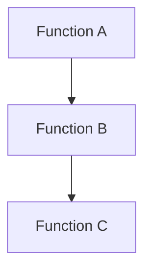
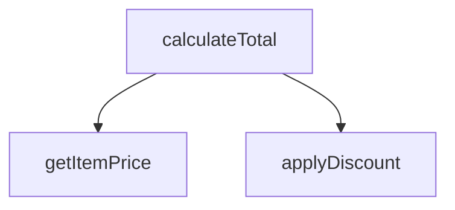

# Function Call Chain Visualizer

This skill visualizes function call chain data from JSON files, providing clear and readable representations of function call relationships.

## When to Use

Invoke this skill when:
- User wants to visualize function call relationships from JSON data
- User needs to generate mdd format for markdown display
- User wants to create knowledge graph or similar visualizations
- User asks to display function call chains with different name types (English, Chinese, or both)

## Input Parameters

| Parameter | Type | Required | Description |
|-----------|------|----------|-------------|
| json_file_path | string | Yes | Absolute path to the JSON file containing function call chain data |
| display_type | string | Yes | Name display type: 'english' (英文函数名), 'chinese' (中文翻译名称), or 'both' (中英文都显示) |
| output_format | string | Yes | Output format: 'mdd' (for markdown display) or 'graph' (for knowledge graph/page view) |

## JSON Data Structure

The input JSON file should have the following structure:

```json
{
  "functions": [
    {
      "id": "func1",
      "name": "calculateTotal",
      "chinese_name": "计算总价",
      "description": "Calculates the total price of items",
      "module": "order",
      "file_path": "/src/order/calculator.js"
    },
    {
      "id": "func2",
      "name": "getItemPrice",
      "chinese_name": "获取商品价格",
      "description": "Gets the price of a single item",
      "module": "product",
      "file_path": "/src/product/price.js"
    }
  ],
  "calls": [
    {
      "from": "func1",
      "to": "func2",
      "call_count": 3,
      "line_number": 45
    }
  ]
}
```

## Output Formats

### 1. MDD Format (for Markdown Display)

Generates a markdown-compatible format that can be directly rendered in markdown viewers. The output includes:

- **Function Overview Table**: Lists all functions with their details
- **Call Chain Diagram**: Visual representation using ASCII art or mermaid syntax
- **Detailed Call Information**: Shows call relationships with counts and locations

#### MDD Output Structure

```markdown
# Function Call Chain Visualization

## Overview

Total Functions: {count}
Total Calls: {count}

## Function List

| ID | Name | Module | Description |
|----|------|--------|-------------|
| ... | ... | ... | ... |

## Call Chain Diagram



## Call Details

### Function A calls:
- Function B (3 times, line 45)

### Function B calls:
- Function C (1 time, line 22)
```

### 2. Graph Format (for Knowledge Graph/Page View)

Generates a structured format suitable for interactive knowledge graph visualization. The output includes:

- **Nodes**: Each function as a node with properties
- **Edges**: Call relationships with properties
- **Metadata**: Additional information for rendering

#### Graph Output Structure

```json
{
  "nodes": [
    {
      "id": "func1",
      "label": "calculateTotal\n(计算总价)",
      "properties": {
        "name": "calculateTotal",
        "chinese_name": "计算总价",
        "module": "order",
        "description": "Calculates the total price of items",
        "file_path": "/src/order/calculator.js"
      }
    }
  ],
  "edges": [
    {
      "id": "edge1",
      "source": "func1",
      "target": "func2",
      "properties": {
        "call_count": 3,
        "line_number": 45
      }
    }
  ],
  "metadata": {
    "total_functions": 2,
    "total_calls": 1,
    "display_type": "both",
    "generated_at": "2026-04-09T10:30:00Z"
  }
}
```

## Display Types

### 1. English Only ('english')
- Displays only the English function names
- Example: `calculateTotal`

### 2. Chinese Only ('chinese')
- Displays only the Chinese translated names
- Example: `计算总价`
- Note: If Chinese name is not available, falls back to English name

### 3. Both ('both')
- Displays both English and Chinese names
- Example: `calculateTotal (计算总价)`
- Format: `{english_name} ({chinese_name})`

## Implementation Steps

When this skill is invoked, follow these steps:

1. **Read and Validate Input**:
   - Read the JSON file from the provided path
   - Validate the JSON structure matches the expected format
   - Check that all required fields are present

2. **Process Function Data**:
   - Extract all functions from the JSON
   - Apply the selected display type to function names
   - Group functions by module if applicable

3. **Process Call Relationships**:
   - Extract all call relationships
   - Map call IDs to actual function names
   - Calculate call statistics (total calls, most called functions, etc.)

4. **Generate Output**:
   - For 'mdd' format: Generate markdown with table, mermaid diagram, and details
   - For 'graph' format: Generate structured JSON with nodes, edges, and metadata

5. **Enhance Readability**:
   - Add clear section headers
   - Use consistent formatting
   - Include statistics and summaries
   - Add comments where helpful

## Example Usage

### Example 1: Generate MDD with English Names

**Input:**
```
json_file_path: "/path/to/call_chain.json"
display_type: "english"
output_format: "mdd"
```

**Output:**
```markdown
# Function Call Chain Visualization

## Overview

Total Functions: 3
Total Calls: 4

## Function List

| ID | Name | Module | Description |
|----|------|--------|-------------|
| func1 | calculateTotal | order | Calculates the total price of items |
| func2 | getItemPrice | product | Gets the price of a single item |
| func3 | applyDiscount | discount | Applies discount to the total |

## Call Chain Diagram



## Call Details

### calculateTotal calls:
- getItemPrice (3 times, line 45)
- applyDiscount (1 time, line 52)
```

### Example 2: Generate Graph with Both Names

**Input:**
```
json_file_path: "/path/to/call_chain.json"
display_type: "both"
output_format: "graph"
```

**Output:**
```json
{
  "nodes": [
    {
      "id": "func1",
      "label": "calculateTotal\n(计算总价)",
      "properties": {
        "name": "calculateTotal",
        "chinese_name": "计算总价",
        "module": "order",
        "description": "Calculates the total price of items",
        "file_path": "/src/order/calculator.js"
      }
    },
    {
      "id": "func2",
      "label": "getItemPrice\n(获取商品价格)",
      "properties": {
        "name": "getItemPrice",
        "chinese_name": "获取商品价格",
        "module": "product",
        "description": "Gets the price of a single item",
        "file_path": "/src/product/price.js"
      }
    }
  ],
  "edges": [
    {
      "id": "edge1",
      "source": "func1",
      "target": "func2",
      "properties": {
        "call_count": 3,
        "line_number": 45
      }
    }
  ],
  "metadata": {
    "total_functions": 2,
    "total_calls": 1,
    "display_type": "both",
    "generated_at": "2026-04-09T10:30:00Z"
  }
}
```

## Best Practices

1. **Readability First**: Always prioritize human readability. Use clear formatting, consistent spacing, and descriptive labels.

2. **Handle Missing Data Gracefully**:
   - If Chinese name is missing, fall back to English name
   - If call count is missing, assume 1
   - If line number is missing, omit it from display

3. **Consistent Formatting**:
   - Use consistent indentation
   - Follow markdown best practices for tables and code blocks
   - Use meaningful section headers

4. **Statistical Insights**:
   - Include total counts for functions and calls
   - Highlight most called functions if applicable
   - Group by module for better organization

5. **Error Handling**:
   - Validate JSON structure before processing
   - Provide clear error messages for invalid inputs
   - Handle file read errors gracefully

## Notes

- This skill is designed for readability, not for performance optimization on very large datasets
- The mermaid diagrams in MDD format are compatible with most markdown viewers that support mermaid
- The graph format output can be directly used with various graph visualization libraries
- Always use absolute paths for JSON file inputs to avoid path resolution issues
