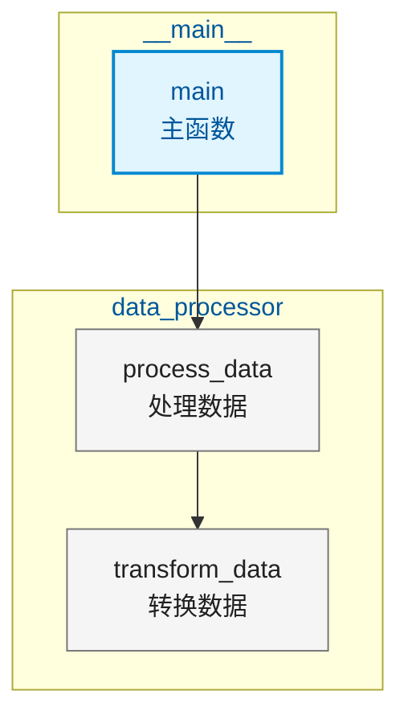
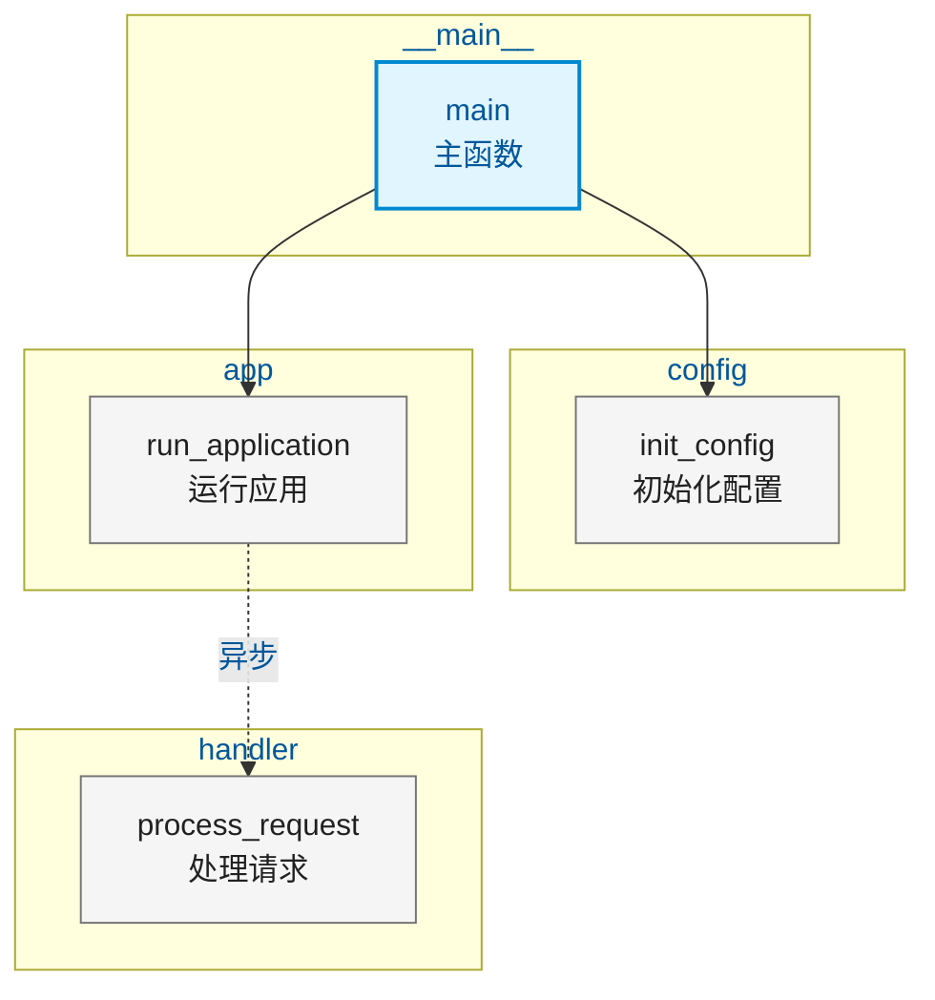

# 函数调用链可视化工具 (Function Call Visualizer)

本skill用于读取函数调用链JSON数据，将调用关系以可视化方式展示。支持两种输出格式：
- **MDD (Mermaid Diagram)**: 可直接在Markdown中渲染的图表
- **知识图谱**: 结构化JSON数据，适用于交互式页面展示

## 何时调用

在以下情况应该自动调用此skill：
- 用户有包含函数调用链数据的JSON文件
- 用户想要可视化函数依赖和调用关系
- 用户需要生成MDD图表用于快速Markdown显示
- 用户需要结构化数据用于知识图谱可视化
- 用户询问调用链分析、函数依赖映射或调用层次可视化

## 输入参数

| 参数 | 类型 | 必填 | 说明 |
|------|------|------|------|
| `json_file` | string | 是 | 函数调用链JSON文件的绝对路径 |
| `display_mode` | string | 是 | 名称显示模式，可选值见下方 |
| `output_type` | string | 是 | 输出格式，可选值见下方 |

### 显示模式 (display_mode)

| 值 | 别名 | 说明 |
|----|------|------|
| `english` | `en` | 仅显示英文函数名 |
| `chinese` | `cn` | 仅显示中文翻译名称 |
| `both` | `all` | 同时显示中英文，格式：`English (中文)` |

### 输出格式 (output_type)

| 值 | 别名 | 说明 |
|----|------|------|
| `mdd` | `mermaid`, `diagram` | 生成Mermaid Diagram语法，可直接在Markdown中渲染 |
| `knowledge-graph` | `graph`, `kg` | 生成结构化JSON数据，适用于交互式知识图谱 |

## 项目结构

```
.trae/skills/function-call-visualizer/
├── SKILL.md                    # 本说明文档
├── main.py                     # 主入口脚本（CLI接口）
├── __init__.py
├── generators/
│   ├── __init__.py
│   ├── mdd_generator.py        # MDD图表生成器
│   └── knowledge_graph_generator.py  # 知识图谱生成器
├── models/
│   ├── __init__.py
│   └── data_models.py          # 数据模型定义和解析
└── utils/
    ├── __init__.py
    └── helpers.py              # 辅助函数（图分析、样式管理等）
```

## 输入JSON格式规范

### 完整结构示例

```json
{
  "project_name": "示例项目",
  "language": "python",
  "call_chains": [
    {
      "chain_id": "chain_001",
      "root_function": {
        "name": "main",
        "name_cn": "主函数",
        "module": "__main__",
        "file_path": "/path/to/main.py",
        "line_number": 10,
        "description": "应用程序主入口"
      },
      "calls": [
        {
          "caller": {
            "name": "main",
            "name_cn": "主函数",
            "module": "__main__"
          },
          "callee": {
            "name": "process_data",
            "name_cn": "处理数据",
            "module": "data_processor"
          },
          "call_site": {
            "file_path": "/path/to/main.py",
            "line_number": 15,
            "column_number": 20
          },
          "arguments": ["input_file"],
          "is_async": false
        }
      ]
    }
  ],
  "function_metadata": {
    "main": {
      "name": "main",
      "name_cn": "主函数",
      "module": "__main__",
      "return_type": "int",
      "parameters": [
        { "name": "args", "type": "list" }
      ],
      "docstring": "主入口函数",
      "visibility": "public"
    }
  }
}
```

### 必填字段说明

| 字段路径 | 类型 | 说明 |
|----------|------|------|
| `call_chains` | array | 调用链列表，至少包含一个调用链 |
| `call_chains[].root_function` | object | 调用链的根函数（入口点） |
| `call_chains[].root_function.name` | string | 英文函数名（必填） |
| `call_chains[].calls` | array | 该调用链中的调用关系列表 |
| `call_chains[].calls[].caller` | object | 调用方函数信息 |
| `call_chains[].calls[].caller.name` | string | 调用方函数名（必填） |
| `call_chains[].calls[].callee` | object | 被调用方函数信息 |
| `call_chains[].calls[].callee.name` | string | 被调用方函数名（必填） |

### 可选但推荐字段

| 字段路径 | 类型 | 说明 |
|----------|------|------|
| `name_cn` | string | 中文函数名，用于中文显示模式 |
| `module` | string | 函数所属模块，用于按模块分组展示 |
| `file_path` | string | 源码文件路径 |
| `line_number` | number | 函数定义所在行号 |
| `is_async` | boolean | 是否为异步调用 |

## 调用执行流程

### 方式一：通过Python代码调用（推荐）

```python
import sys
from pathlib import Path

# 将skill目录添加到Python路径
skill_dir = Path("/path/to/.trae/skills/function-call-visualizer")
sys.path.insert(0, str(skill_dir))

from main import FunctionCallVisualizer

# 创建可视化器实例
visualizer = FunctionCallVisualizer()

# 执行可视化
result = visualizer.visualize(
    json_file="/path/to/call_chains.json",
    display_mode="both",      # 可选: english, chinese, both
    output_type="mdd",         # 可选: mdd, knowledge-graph
    compact=False,             # 紧凑模式（适用于大型调用链）
    enhanced=False             # 增强模式（知识图谱额外信息）
)

# 处理结果
if result["success"]:
    if result["output"]["type"] == "mdd":
        # 获取MDD图表
        mdd_code = result["output"]["diagram"]
        print("生成的MDD代码:")
        print(mdd_code)
    else:
        # 获取知识图谱数据
        graph_data = result["output"]["data"]
        print("生成的知识图谱数据:")
        import json
        print(json.dumps(graph_data, ensure_ascii=False, indent=2))
    
    # 获取统计信息
    print("\n统计信息:")
    for key, value in result["statistics"].items():
        print(f"  {key}: {value}")
else:
    print(f"错误: {result['error']}")
```

### 方式二：通过命令行调用

```bash
# 进入skill目录
cd /path/to/.trae/skills/function-call-visualizer

# 生成MDD图表（英文显示）
python main.py \
  --json-file /path/to/call_chains.json \
  --display-mode english \
  --output-type mdd

# 生成MDD图表（中英文显示）并保存到文件
python main.py \
  --json-file /path/to/call_chains.json \
  --display-mode both \
  --output-type mdd \
  --output-file /path/to/output.mmd

# 生成知识图谱数据（美化JSON）
python main.py \
  --json-file /path/to/call_chains.json \
  --display-mode chinese \
  --output-type knowledge-graph \
  --pretty

# 仅验证JSON格式
python main.py \
  --json-file /path/to/call_chains.json \
  --validate
```

### 方式三：Agent自动调用流程

当用户请求可视化函数调用链时，Agent应按以下步骤执行：

1. **参数确认**
   - 确认JSON文件路径
   - 确认显示模式（如用户未指定，默认使用 `both`）
   - 确认输出类型（如用户未指定，根据场景选择：
     - 用户说"生成图表"或"在Markdown中展示" → `mdd`
     - 用户说"生成知识图谱"或"用于页面展示" → `knowledge-graph`
   ）

2. **验证输入**
   - 检查JSON文件是否存在
   - 使用 `visualizer.validate_json()` 验证格式
   - 如验证失败，向用户报告具体错误

3. **执行生成**
   - 调用 `visualizer.visualize()` 方法
   - 处理返回结果

4. **输出结果**
   - 对于 `mdd` 类型：直接展示Mermaid代码块
   - 对于 `knowledge-graph` 类型：展示结构化JSON，或说明如何使用
   - 同时展示统计信息

## 输出格式详解

### MDD (Mermaid Diagram) 输出

生成的Mermaid代码可以直接在以下环境中渲染：
- GitHub Markdown
- VS Code（安装Mermaid插件）
- GitLab
- Mermaid Live Editor (https://mermaid.live/)

#### 示例输出



#### 节点样式说明

| 样式类 | 颜色 | 用途 |
|--------|------|------|
| `root` | 浅蓝色背景，深蓝色边框 | 入口函数/根函数 |
| `func` | 浅灰色背景，灰色边框 | 普通函数 |
| `lib` | 浅橙色背景，橙色边框 | 库函数/外部函数 |
| `class` | 浅紫色背景，紫色边框 | 类定义 |

#### 边样式说明

| 箭头类型 | 标签 | 用途 |
|----------|------|------|
| `-->` | 无 | 同步调用 |
| `-.->` | 异步 | 异步调用 |
| `-.->` | 条件: xxx | 条件调用 |
| `-.->` | 循环 | 循环内调用 |
| `-.->` | 循环依赖 | 循环依赖 |
| `-->` | xN | 多次调用（N为次数） |

### 知识图谱 (Knowledge Graph) 输出

生成的JSON数据包含完整的图结构信息，可用于：
- D3.js 可视化
- Cytoscape.js 可视化
- Neo4j 图数据库导入
- 自定义交互式页面

#### 输出结构

```json
{
  "graph": {
    "metadata": {
      "project_name": "示例项目",
      "language": "python",
      "display_mode": "both",
      "generated_at": "2024-01-15T10:30:00Z"
    },
    "nodes": [
      {
        "id": "node_001",
        "label": "main (主函数)",
        "label_en": "main",
        "label_cn": "主函数",
        "type": "function",
        "subtype": "root",
        "module": "__main__",
        "file_path": "/path/to/main.py",
        "line_number": 10,
        "metadata": {
          "return_type": "int",
          "visibility": "public",
          "in_degree": 0,
          "out_degree": 2
        },
        "style": {
          "color": "#e1f5fe",
          "border_color": "#0288d1"
        }
      }
    ],
    "edges": [
      {
        "id": "edge_001",
        "source": "node_001",
        "target": "node_002",
        "type": "calls",
        "subtype": "sync",
        "label": "调用",
        "metadata": {
          "call_site": { "file_path": "...", "line_number": 15 },
          "arguments": ["input_file"]
        },
        "style": {
          "color": "#9e9e9e",
          "width": 1.5
        }
      }
    ],
    "modules": [
      {
        "id": "module_0",
        "name": "__main__",
        "nodes": ["node_001"],
        "color": "#bbdefb"
      }
    ]
  },
  "statistics": {
    "total_nodes": 15,
    "total_edges": 23,
    "total_modules": 5,
    "root_functions": 1,
    "circular_dependencies": 2,
    "max_depth": 4,
    "avg_calls_per_function": 1.53
  }
}
```

## 高级特性

### 循环依赖检测

自动检测循环依赖关系，并在输出中标记：

- **MDD中**: 边会标记为 "循环依赖"
- **知识图谱中**: `edge.metadata.is_circular = true`

### 按模块分组

自动按 `module` 字段对函数进行分组：

- **MDD中**: 使用 `subgraph` 组织
- **知识图谱中**: 生成 `modules` 数组，包含每个模块的节点列表

### 统计信息

每次调用都会返回详细的统计信息：

| 统计项 | 说明 |
|--------|------|
| `total_nodes` | 总节点数（函数数量） |
| `total_edges` | 总边数（调用关系数量） |
| `total_modules` | 模块总数 |
| `root_functions` | 入口函数数量 |
| `circular_dependencies` | 循环依赖数量 |
| `max_depth` | 调用链最大深度 |
| `avg_calls_per_function` | 平均每个函数的调用数 |
| `module_distribution` | 各模块的函数分布 |

### 紧凑模式 (Compact Mode)

对于大型调用链（节点数 > 30），可使用紧凑模式自动分割为多个子图：

```python
result = visualizer.visualize(
    json_file="/path/to/large_call_chains.json",
    display_mode="both",
    output_type="mdd",
    compact=True  # 启用紧凑模式
)

# 结果包含多个图表
print(f"生成了 {result['output']['diagram_count']} 个图表")
for i, diagram in enumerate(result['output']['diagrams']):
    print(f"\n--- 图表 {i+1} ---")
    print(diagram)
```

### 增强模式 (Enhanced Mode)

知识图谱输出可启用增强模式，包含额外的层次结构信息：

```python
result = visualizer.visualize(
    json_file="/path/to/call_chains.json",
    display_mode="both",
    output_type="knowledge-graph",
    enhanced=True  # 启用增强模式
)

# 额外的层次信息
hierarchy = result['output']['data']['hierarchy']
layers = result['output']['data']['layers']

print("层次结构:")
print(f"  根节点: {hierarchy['roots']}")
print(f"  层级映射: {hierarchy['levels']}")
```

## 错误处理

### 常见错误类型

| 错误类型 | 原因 | 处理方式 |
|----------|------|----------|
| 文件不存在 | `json_file` 路径错误 | 提示用户检查文件路径 |
| JSON解析错误 | JSON格式语法错误 | 提示用户具体的语法错误位置 |
| 验证失败 | 缺少必填字段 | 列出所有缺失的字段 |
| 空调用链 | JSON中没有调用数据 | 提示用户检查输入数据 |

### 错误处理示例

```python
result = visualizer.visualize(...)

if not result["success"]:
    print(f"处理失败: {result['error']}")
    print(f"错误类型: {result.get('error_type', 'Unknown')}")
    
    # 尝试验证获取更详细信息
    validation = visualizer.validate_json(json_file)
    if not validation["success"]:
        print("\n验证错误详情:")
        for err in validation["errors"]:
            print(f"  - {err}")
```

## 使用示例

### 示例1：简单调用链可视化

**输入JSON** (`simple_chain.json`):
```json
{
  "call_chains": [
    {
      "root_function": {
        "name": "main",
        "name_cn": "主函数",
        "module": "__main__"
      },
      "calls": [
        {
          "caller": { "name": "main", "name_cn": "主函数", "module": "__main__" },
          "callee": { "name": "init_config", "name_cn": "初始化配置", "module": "config" },
          "is_async": false
        },
        {
          "caller": { "name": "main", "name_cn": "主函数", "module": "__main__" },
          "callee": { "name": "run_application", "name_cn": "运行应用", "module": "app" },
          "is_async": false
        },
        {
          "caller": { "name": "run_application", "name_cn": "运行应用", "module": "app" },
          "callee": { "name": "process_request", "name_cn": "处理请求", "module": "handler" },
          "is_async": true
        }
      ]
    }
  ]
}
```

**调用代码**:
```python
result = visualizer.visualize(
    json_file="simple_chain.json",
    display_mode="both",
    output_type="mdd"
)
```

**输出MDD**:


### 示例2：知识图谱用于页面展示

**调用代码**:
```python
result = visualizer.visualize(
    json_file="call_chains.json",
    display_mode="chinese",
    output_type="knowledge-graph",
    enhanced=True
)

# 提取数据用于前端
graph = result["output"]["data"]["graph"]
nodes = graph["nodes"]
edges = graph["edges"]
modules = graph["modules"]

# 前端使用示例（伪代码）：
# const cy = cytoscape({
#   elements: {
#     nodes: nodes.map(n => ({ data: { id: n.id, label: n.label } })),
#     edges: edges.map(e => ({ data: { id: e.id, source: e.source, target: e.target } }))
#   },
#   style: [
#     { selector: 'node', style: { 'background-color': 'data(style.color)', 'label': 'data(label)' } }
#   ]
# });
```

## 最佳实践

### 可读性优化

1. **使用 `both` 显示模式**
   - 同时显示英文和中文名称
   - 方便中英文用户理解
   - MDD中使用 `<br/>` 换行，更清晰

2. **填写 `module` 字段**
   - 按模块分组展示
   - 减少视觉复杂度
   - 便于理解代码组织

3. **提供 `name_cn` 字段**
   - 支持纯中文显示模式
   - 便于中文用户快速理解

### 性能考虑

1. **大型调用链 (>50节点)**
   - 使用 `knowledge-graph` 输出
   - 前端可实现交互过滤
   - 启用 `compact=True` 分割MDD

2. **实时预览**
   - MDD适合快速预览（<30节点）
   - 知识图谱适合详细分析

### 数据准备

1. **统一函数命名**
   - 确保 `name` 字段在整个JSON中唯一标识同一函数
   - 不同模块的同名函数需要区分（使用 `module` 字段）

2. **完整的调用关系**
   - 确保所有调用的 `caller` 和 `callee` 都能对应到实际函数
   - 避免孤立节点（无入边也无出边）

## 相关技能

- **代码分析器**: 用于从源代码生成调用链JSON数据
- **文档生成器**: 将调用图整合到API文档中
- **重构助手**: 利用调用图分析进行重构建议

## 版本信息

- **版本**: 1.0.0
- **Python版本要求**: >= 3.7
- **依赖**: 无外部依赖（仅使用标准库）

## 更新日志

### v1.0.0 (2024-01-15)
- 初始版本发布
- 支持MDD和知识图谱两种输出格式
- 支持三种显示模式（英文、中文、中英文）
- 实现循环依赖检测
- 实现按模块分组
- 提供详细统计信息
- 支持紧凑模式和增强模式
