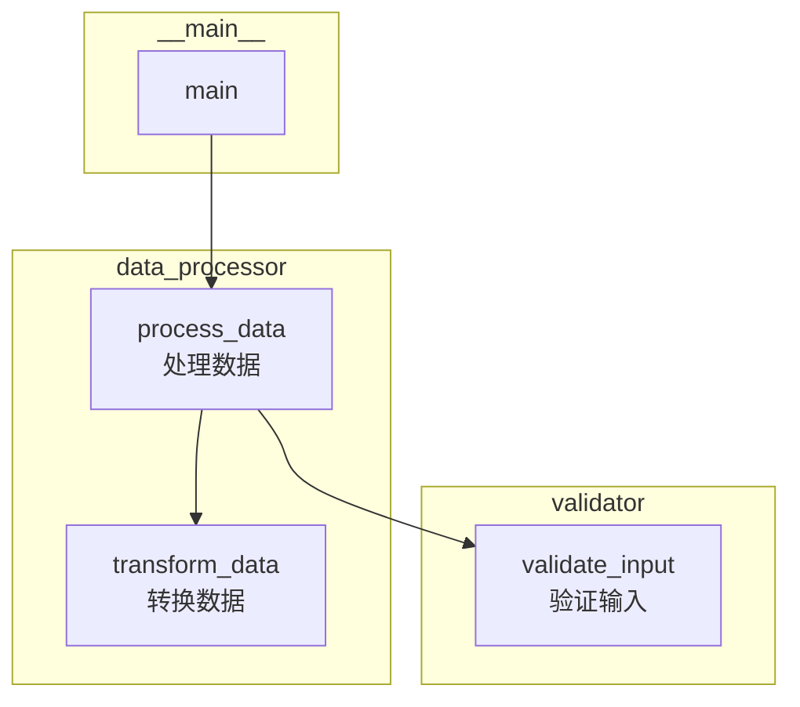
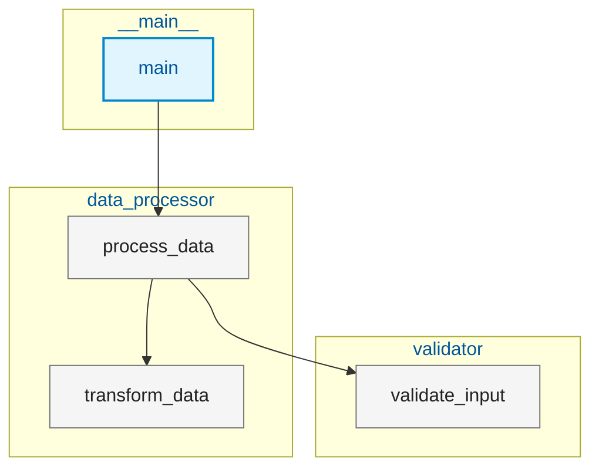
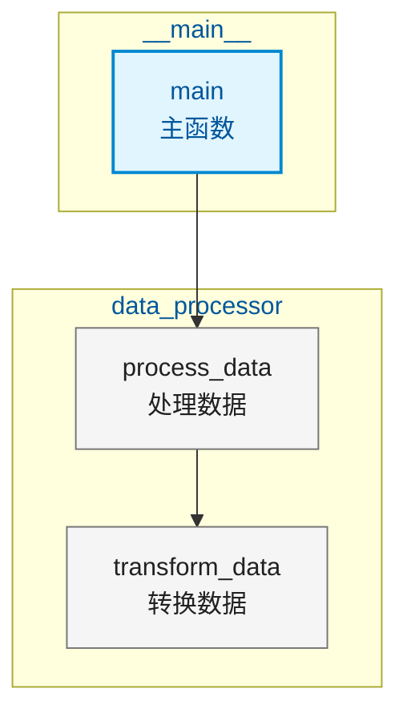

# Function Call Visualizer

This skill reads function call chain data from JSON files and generates visual representations for human-readable analysis.

## When to Invoke

- User has a JSON file containing function call chain data
- User wants to visualize function dependencies and call relationships
- User needs to generate MDD diagrams for quick Markdown display
- User needs structured data for knowledge graph visualization
- User asks for call chain analysis, function dependency mapping, or call hierarchy visualization

## Input Parameters

| Parameter | Type | Required | Description |
|-----------|------|----------|-------------|
| `json_file` | string | Yes | Absolute path to the JSON file containing function call chain data |
| `display_mode` | string | Yes | Name display mode. One of: `english`, `chinese`, `both` |
| `output_type` | string | Yes | Output format. One of: `mdd`, `knowledge-graph` |

### Display Modes

- `english`: Show only English function names
- `chinese`: Show only Chinese translated names
- `both`: Show both English and Chinese names in format: `English (中文)`

### Output Types

- `mdd`: Generate Mermaid Diagram syntax for direct Markdown rendering
- `knowledge-graph`: Generate structured JSON data suitable for interactive knowledge graph visualization

## Input JSON Structure

The JSON file must contain function call chain data with the following structure:

```json
{
  "project_name": "my-project",
  "language": "python",
  "call_chains": [
    {
      "chain_id": "chain_001",
      "root_function": {
        "name": "main",
        "name_cn": "主函数",
        "module": "__main__",
        "file_path": "/path/to/main.py",
        "line_number": 10,
        "description": "Main entry point of the application"
      },
      "calls": [
        {
          "caller": {
            "name": "main",
            "name_cn": "主函数",
            "module": "__main__"
          },
          "callee": {
            "name": "process_data",
            "name_cn": "处理数据",
            "module": "data_processor"
          },
          "call_site": {
            "file_path": "/path/to/main.py",
            "line_number": 15,
            "column_number": 20
          },
          "arguments": ["input_file"],
          "is_async": false
        },
        {
          "caller": {
            "name": "process_data",
            "name_cn": "处理数据",
            "module": "data_processor"
          },
          "callee": {
            "name": "validate_input",
            "name_cn": "验证输入",
            "module": "validator"
          },
          "call_site": {
            "file_path": "/path/to/data_processor.py",
            "line_number": 42,
            "column_number": 8
          },
          "arguments": ["raw_data"],
          "is_async": false
        }
      ]
    }
  ],
  "function_metadata": {
    "main": {
      "name": "main",
      "name_cn": "主函数",
      "module": "__main__",
      "return_type": "int",
      "parameters": [
        { "name": "args", "type": "list" }
      ],
      "docstring": "Main entry point",
      "visibility": "public"
    },
    "process_data": {
      "name": "process_data",
      "name_cn": "处理数据",
      "module": "data_processor",
      "return_type": "dict",
      "parameters": [
        { "name": "input_data", "type": "str" }
      ],
      "docstring": "Process input data and return results",
      "visibility": "public"
    }
  }
}
```

### Required Fields

| Field | Type | Description |
|-------|------|-------------|
| `name` | string | English function name (required) |
| `name_cn` | string | Chinese translated name (optional, fallback to `name` if missing) |
| `module` | string | Module/package name containing the function |
| `calls[].caller` | object | Calling function information |
| `calls[].callee` | object | Called function information |

## Output: MDD (Mermaid Diagram)

Generates Mermaid diagram syntax optimized for readability.

### Display Logic

```
function getDisplayedName(func, display_mode):
    if display_mode == 'english':
        return func.name
    elif display_mode == 'chinese':
        return func.name_cn or func.name
    elif display_mode == 'both':
        if func.name_cn:
            return f"{func.name} ({func.name_cn})"
        else:
            return func.name
```

### Diagram Structure

Use `flowchart TD` (Top-Down) for hierarchical call chains.

#### Node Styling

```
# Root functions (entry points)
root[Name]:::root

# Regular functions
func[Name]:::func

# Library/built-in functions
lib[Name]:::lib

# Class definitions
class[Name]:::class
```

#### Style Definitions

```mermaid
classDef root fill:#e1f5fe,stroke:#0288d1,stroke-width:2px,color:#01579b;
classDef func fill:#f5f5f5,stroke:#757575,stroke-width:1px,color:#212121;
classDef lib fill:#fff3e0,stroke:#f57c00,stroke-width:1px,color:#e65100;
classDef class fill:#f3e5f5,stroke:#7b1fa2,stroke-width:1px,color:#4a148c;
classDef callLink stroke:#9e9e9e,stroke-width:1.5px;
```

#### Call Relationships

```
# Regular call
caller --> callee

# Async call
caller -.->|async| callee

# Conditional call
caller -.->|if condition| callee

# Loop call
caller -.->|loop| callee
```

### Grouping by Module

Use `subgraph` to group functions by module:



### Edge Cases Handling

1. **Circular Dependencies**: Detect and mark with special styling
   ```
   A -.->|circular| B
   B -.->|circular| A
   ```

2. **Missing `name_cn`**: Fall back to English name
3. **Duplicate Calls**: Aggregate and show count
   ```
   A -->|x3| B
   ```
4. **Deep Hierarchies**: Truncate and add expand markers
   ```
   A --> B --> C[...]:::more
   ```

## Output: Knowledge Graph

Generates structured JSON data for interactive visualization.

### Output Structure

```json
{
  "graph": {
    "metadata": {
      "project_name": "my-project",
      "language": "python",
      "display_mode": "both",
      "generated_at": "2024-01-15T10:30:00Z"
    },
    "nodes": [
      {
        "id": "node_001",
        "label": "main (主函数)",
        "label_en": "main",
        "label_cn": "主函数",
        "type": "function",
        "subtype": "root",
        "module": "__main__",
        "file_path": "/path/to/main.py",
        "line_number": 10,
        "metadata": {
          "return_type": "int",
          "visibility": "public",
          "in_degree": 0,
          "out_degree": 2,
          "call_count": 5
        },
        "style": {
          "color": "#e1f5fe",
          "border_color": "#0288d1",
          "shape": "rounded"
        }
      }
    ],
    "edges": [
      {
        "id": "edge_001",
        "source": "node_001",
        "target": "node_002",
        "type": "calls",
        "subtype": "sync",
        "label": "调用",
        "metadata": {
          "call_site": {
            "file_path": "/path/to/main.py",
            "line_number": 15
          },
          "arguments": ["input_file"],
          "call_count": 1,
          "is_conditional": false,
          "is_loop": false
        },
        "style": {
          "color": "#9e9e9e",
          "width": 1.5,
          "dash_style": "solid"
        }
      }
    ],
    "modules": [
      {
        "id": "module_001",
        "name": "__main__",
        "nodes": ["node_001"],
        "color": "#bbdefb"
      }
    ]
  },
  "statistics": {
    "total_nodes": 15,
    "total_edges": 23,
    "total_modules": 5,
    "root_functions": 1,
    "circular_dependencies": 2,
    "max_depth": 4,
    "avg_calls_per_function": 1.53
  }
}
```

### Node Types

| Type | Subtype | Description | Color |
|------|---------|-------------|-------|
| function | root | Entry point function | #e1f5fe |
| function | regular | Regular function | #f5f5f5 |
| function | library | External/library function | #fff3e0 |
| class | - | Class definition | #f3e5f5 |
| module | - | Module/package grouping | #e8f5e9 |

### Edge Types

| Type | Subtype | Description | Style |
|------|---------|-------------|-------|
| calls | sync | Synchronous function call | Solid line |
| calls | async | Asynchronous function call | Dashed line |
| calls | conditional | Call inside conditional block | Dotted line |
| calls | loop | Call inside loop | Dash-dot line |
| imports | - | Module import | Light gray |
| inherits | - | Class inheritance | Purple |

## Usage Examples

### Example 1: Generate MDD with English Only

**Input:**
```
json_file: "/path/to/call_chains.json"
display_mode: "english"
output_type: "mdd"
```

**Output:**


### Example 2: Generate MDD with Both Languages

**Input:**
```
json_file: "/path/to/call_chains.json"
display_mode: "both"
output_type: "mdd"
```

**Output:**


### Example 3: Generate Knowledge Graph Data

**Input:**
```
json_file: "/path/to/call_chains.json"
display_mode: "chinese"
output_type: "knowledge-graph"
```

**Output:** See "Knowledge Graph" section above for structure.

## Best Practices

1. **Readability First**:
   - Use line breaks (`<br/>`) in MDD nodes for long function names
   - Group by module to reduce visual complexity
   - Color-code node types for quick recognition

2. **Performance Considerations**:
   - For large call chains (>50 nodes), consider using `knowledge-graph` output for interactive filtering
   - MDD is best for chains with <30 nodes for optimal readability

3. **Edge Case Handling**:
   - Always validate JSON structure before processing
   - Handle missing `name_cn` fields gracefully
   - Detect and mark circular dependencies clearly

4. **Consistency**:
   - Use consistent node styling across all diagrams
   - Maintain the same color scheme for node types
   - Use standardized edge labels

## Implementation Steps

When invoking this skill, follow these steps:

1. **Read and Validate Input**:
   - Read the JSON file from `json_file` path
   - Validate required fields exist (`name`, `calls[]`)
   - Check for valid `display_mode` and `output_type`

2. **Build Function Registry**:
   - Collect all unique functions from `call_chains`
   - Map `name` to `name_cn` for translation lookup
   - Track modules and file paths

3. **Build Call Graph**:
   - Create nodes for each unique function
   - Create edges for each caller→callee relationship
   - Track edge metadata (arguments, async, etc.)

4. **Generate Output**:
   - For `mdd`: Construct Mermaid diagram syntax
   - For `knowledge-graph`: Construct structured JSON

5. **Enhance Readability**:
   - Add grouping by module
   - Apply styling based on function type
   - Add statistics summary

## Error Handling

| Error | Handling |
|-------|----------|
| File not found | Return clear error message with file path |
| Invalid JSON | Return parsing error with line number |
| Missing required fields | Return validation error with missing field names |
| Invalid display_mode | Fallback to `english` with warning |
| Invalid output_type | Fallback to `mdd` with warning |
| Empty call chains | Return message indicating no call data |

## Related Skills

- `code-analyzer`: For generating call chain JSON data from source code
- `documentation-generator`: For creating comprehensive documentation including call diagrams
- `refactoring-assistant`: For using call graph insights to suggest refactoring

## Notes

- This skill is designed for **readability** by humans, not machine parsing optimization
- MDD output can be directly rendered in Markdown viewers that support Mermaid (GitHub, VS Code, etc.)
- Knowledge graph output can be used with visualization libraries like D3.js, Cytoscape.js, or Neo4j
- The `name_cn` field is optional - if not present, all display modes will use the English `name`
